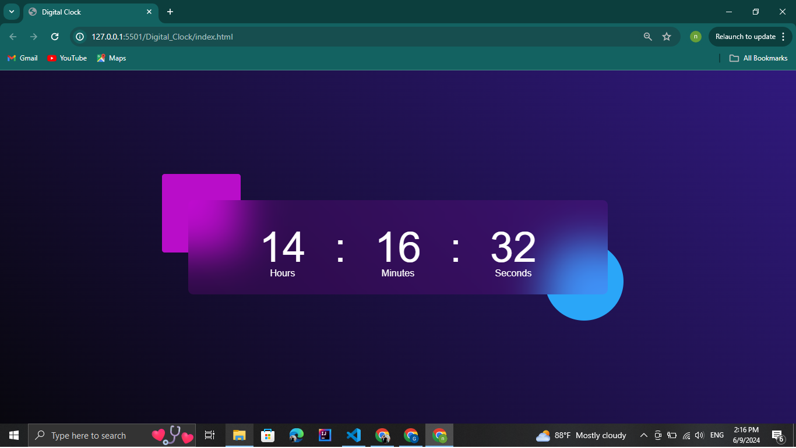

# Digital Clock :clock1:

This is a responsive digital clock web application built using HTML, CSS, and JavaScript. The clock displays the current time in hours, minutes, and seconds based on the local time zone of the user's device.

## Features :sparkles:

- Displays the current time in hours, minutes, and seconds.
- Updates the time in real-time without requiring page refresh.
- The clock design features a stylish gradient background and animated shapes for an enhanced visual experience.
- Responsive layout for optimal viewing on various devices.

## Screenshots :camera:

## Usage 

- The digital clock will automatically display the current time in hours, minutes, and seconds.
- The clock updates every second to reflect the current time.

## Customization 

You can customize the design of the digital clock by modifying the CSS styles in the `style.css` file. Feel free to experiment with colors, fonts, and layout to personalize the clock to your liking. :rocket::sparkles:

